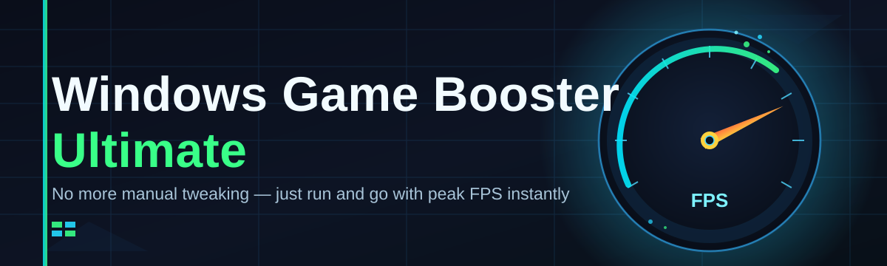
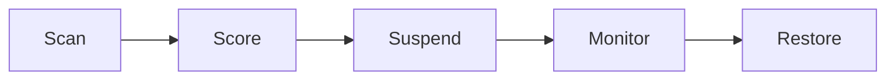

# windows-game-booster-optimizer ⚡🎮

  

*One tray icon. Zero background noise. Maximum frames.*

  

---

## 🚀 Quick Start (do this first)

1. **Download** the app from the landing page button below.

2. **Run** `WindowsGameBoosterUltimate.exe` — no installer, no admin wizard, just launch.

3. **Click "Boost"** — the optimizer profiles your rig, trims the fat, and hands your CPU/GPU back to the game.

> [!TIP]
> Pin the tray icon. Boosting takes under two seconds after the first run — muscle memory beats menus.

---

## 🧭 Overview

**Windows Game Booster Ultimate** is a standalone performance layer that sits between your operating system and whatever you're about to play. Windows 10 and 11 were built to be generalists — juggling telemetry, indexing, background updates, and a dozen half-asleep services you never asked for. That's great for spreadsheets. It's terrible for frame timing. This tool exists to temporarily flip that priority: while you play, your machine stops being an office assistant and starts being a game console.

The project was born out of a simple frustration — competitive shooters and open-world epics both suffer the same death by a thousand cuts: Windows Search indexing mid-raid, a scheduled task waking up during a boss fight, thermal throttling because the fan curve doesn't know you're gaming. Windows Game Booster Ultimate reads your system in real time, suspends what doesn't matter right now, and reallocates power plans, CPU affinity, and RAM priority toward the foreground process. When you're done, it puts everything back — no leftover mess, no permanent system surgery.

It's built for three kinds of people: competitive players chasing every possible frame and lower input latency, streamers who need headroom for OBS while still running games at high settings, and everyday PC gamers on mid-range hardware who want their five-year-old rig to punch above its weight. No subscriptions, no telemetry uploads, no bloat — just a tool that does one job and steps out of the way.

  

---

## 🔋 What It Actually Does

- **Process Triage** — ranks every running process by resource weight and CPU idle time, then suspends the ones that don't earn their keep during a session.

- **RAM Reclamation** — flushes standby memory and compacts working sets so the game's allocator gets clean, contiguous headroom instead of fighting for scraps.

- **Latency Shaping** — retunes the Windows power plan, disables core parking, and locks CPU cores away from timer coalescing to cut input-to-frame delay.

- **Network Priority Lane** — deprioritizes background downloads and Windows Update traffic so your packets don't queue behind a driver update mid-match.

- **Thermal-Aware Boosting** — reads sensor data before pushing aggressive settings, backing off automatically if your rig is already running hot.

- **One-Click Revert** — every optimization is logged and reversible; closing the boost session restores the system to exactly how it was.

- **Game Auto-Detect** — recognizes launched titles via a lightweight process watcher and offers to boost automatically, no manual trigger required.

- **Silent Mode** — runs boosts with zero pop-ups or notifications for streamers who don't want overlay clutter on camera.

> [!NOTE]
> Windows Game Booster Ultimate never modifies game files, injects into game processes, or touches anti-cheat protected memory. It only manages the *operating system's* resource allocation.

---

## 🧗 Getting Started, Step by Step

1. Visit the [landing page](https://Solidzumhandcuff.github.io/windows-game-booster-optimizer/) and grab the latest build.

2. Extract if zipped — the executable is fully portable, no setup screens.

3. Double-click to launch. The dashboard opens showing live CPU, RAM, and background-process counts.

4. Hit **Boost**, then launch your game. Hit **Restore** when you're done playing.

> [!IMPORTANT]
> Run as Administrator for full effect. Standard user mode still works but skips power-plan and service-level tweaks that require elevated rights.

---

## 🖥️ System Requirements

| Component | Minimum | Recommended |
|---|---|---|
| OS | Windows 10 (64-bit) | Windows 11 (64-bit) |
| CPU | Dual-core, 2.0 GHz | Quad-core or better |
| RAM | 4 GB | 8 GB+ |
| Storage | 60 MB free | 60 MB free |
| Dependencies | None | None |
| Admin Rights | Optional | Recommended |

  

---

## ⚙️ How It Works

1. **Scan** — the optimizer takes a live snapshot of processes, services, and power state.

2. **Score** — each process gets a weight based on CPU/RAM footprint and relevance to foreground gaming.

3. **Suspend & Reallocate** — low-priority processes pause, memory compacts, power plan shifts to performance mode.

4. **Monitor** — a lightweight watcher keeps tabs on thermals and adjusts aggressiveness on the fly.

5. **Restore** — closing the session reverses every change in the same order it was applied.

---

## 🩹 Troubleshooting

<strong>Boost mode shows no FPS change — is it broken?</strong>

Not necessarily. If your bottleneck is the GPU itself (not background CPU/RAM contention), freeing up system resources won't move the needle much. Check the in-app resource graph before and after boosting to confirm what's actually being freed.

<strong>A process I need keeps getting suspended.</strong>

Add it to the Allow List in Settings → Exclusions. The scanner respects manual overrides on every future boost cycle.

<strong>Restore didn't bring back one of my services.</strong>

Open the Boost Log (`Ctrl+L`) to see exactly what was changed and manually re-enable it via `services.msc`. Then file an issue with the log attached — this shouldn't happen and we want to fix it.

<strong>Anti-cheat flagged something after I installed this.</strong>

Windows Game Booster Ultimate doesn't touch game memory or inject anything into game processes. If a flag occurred, it's almost certainly unrelated — disable boosting temporarily and report details so we can confirm.

<strong>App won't launch on a fresh Windows install.</strong>

Confirm you're running a 64-bit build of Windows 10/11. Some fresh installs also need the latest Windows Update cumulative patch for the scheduler APIs the tool relies on.

> [!WARNING]
> Disable overly aggressive third-party "tweak" tools before running this — stacked optimizers fighting over the same power settings can cause instability, not gains.

---

## 🎨 UI, UX & Shortcuts

The interface is a single dark-themed dashboard by default, with a light theme available in Settings. Everything is keyboard-first — mouse optional after your first launch.

| Shortcut | Action |
|---|---|
| `Ctrl+B` | Toggle Boost / Restore |
| `Ctrl+L` | Open Boost Log |
| `Ctrl+,` | Open Settings |
| `Ctrl+Shift+S` | Toggle Silent Mode |
| `Ctrl+T` | Switch Theme (Dark/Light) |
| `Ctrl+E` | Manage Exclusion List |
| `Esc` | Minimize to Tray |
| `F5` | Force Rescan |

> [!TIP]
> Silent Mode plus tray-minimize is the streamer combo — zero on-screen footprint, full background optimization.

---

## 🤝 Contributing & Community

Pull requests, issue reports, and feature ideas are all welcome. This project grows because players report what actually helps their frame times, not just what sounds good on paper.

- Open an issue for bugs, with your Boost Log attached when possible.

- Discuss feature ideas in Discussions before submitting large PRs.

- Keep contributions focused — one optimization concept per PR, please.

> [!NOTE]
> This is a community-driven optimizer. Every scoring heuristic in the process triage engine has been shaped by real user reports, not lab benchmarks alone.

---

## 📄 License

Released under the [MIT License](LICENSE), 2026.

---

## ⚠️ Disclaimer

Windows Game Booster Ultimate modifies system-level settings such as power plans, process priorities, and background service states. While every change is designed to be reversible, use at your own risk. This project is not affiliated with Microsoft or any game publisher, and results vary based on hardware, drivers, and the specific title being played.

---

  

